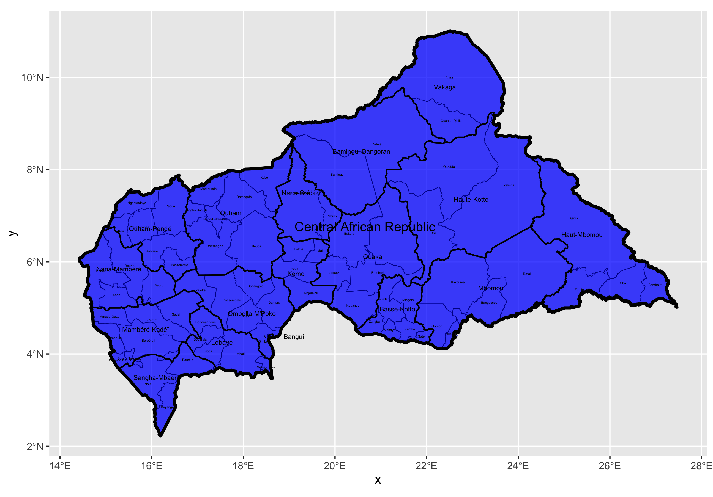
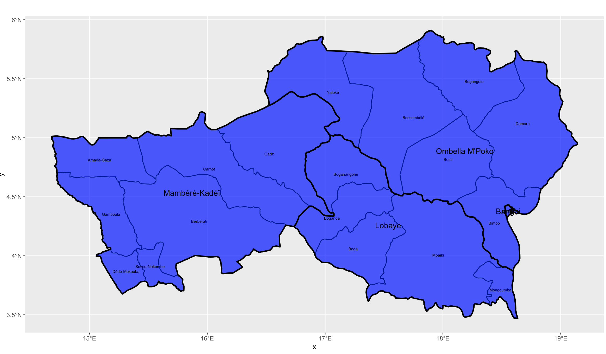
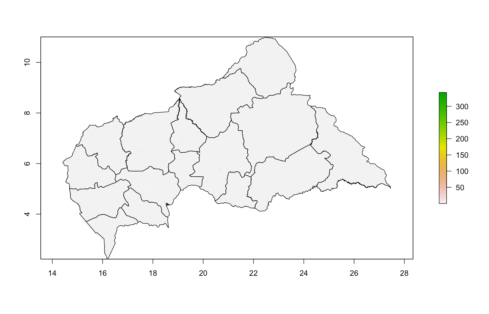
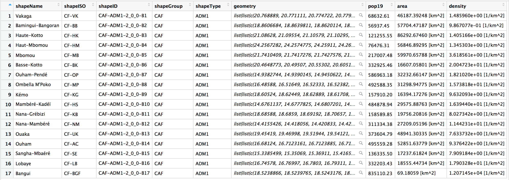
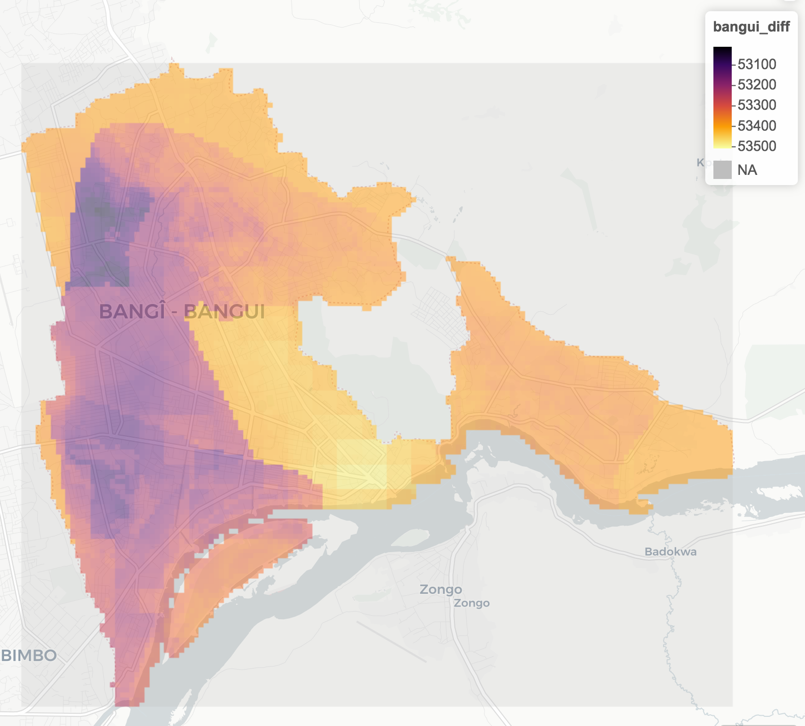
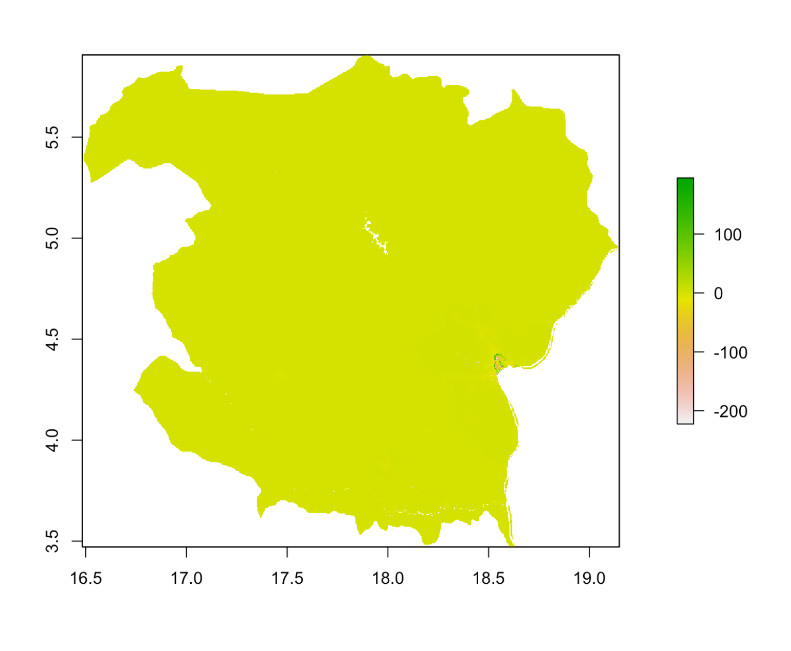
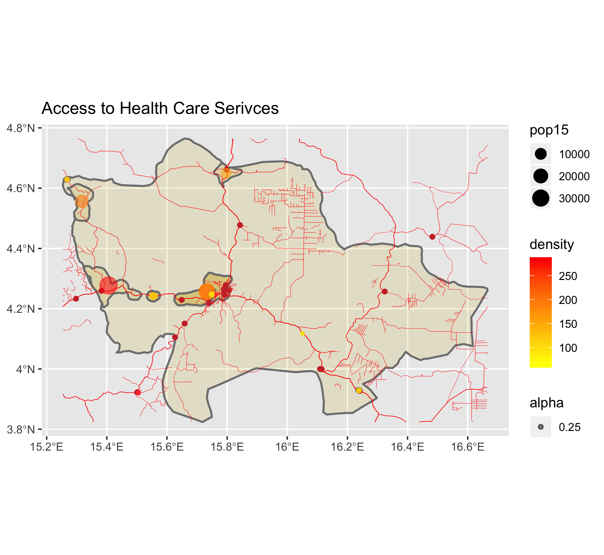
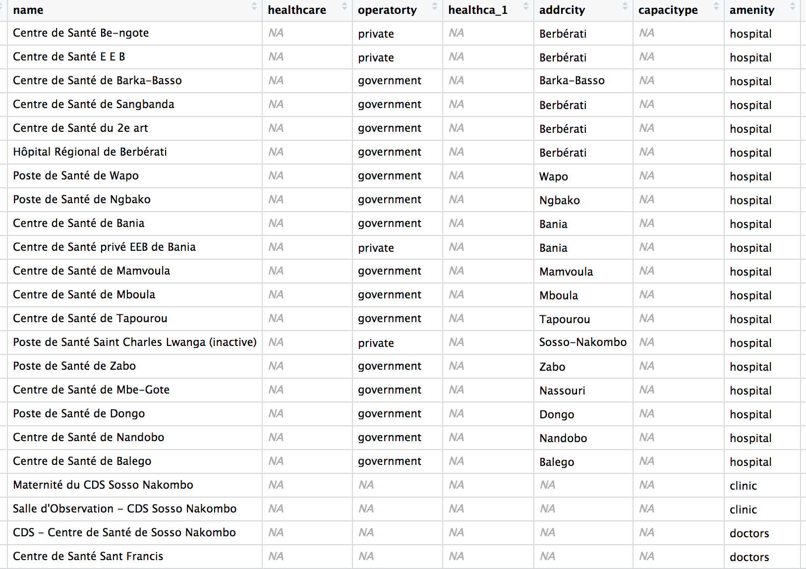
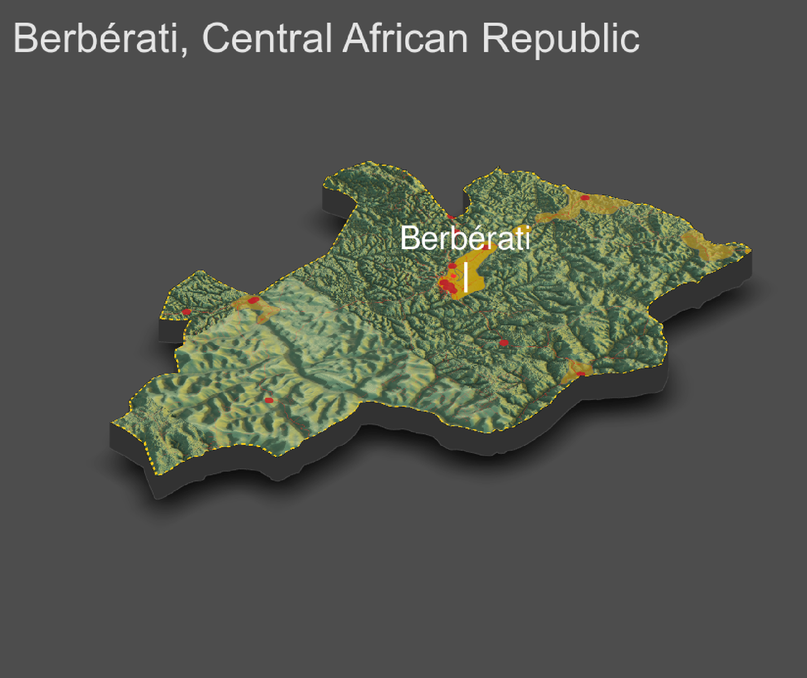

# Final Project

## Political Subdivisions

The Central African Republic has four different administrative divisions: country, prefecture, sub prefecture, and ADMs. The country is first divided up into 17 prefectures, which includes the capital city of Bangui (ADM1). Throughout this class, I have investigated areas in four different prefectures: Bangui (capital city), Lobaye, Ombella M'Poko, and Mambéré-Kadéi. All of these prefectures are clustered in the southwestern section of the state and represent some of the most populated areas. The next level of subdivision is sub prefecture, of which is has 72. As I was completing this project, I found an interesting discrepancy in my data. The GADM data that I had used for the first project only has 51 ADM2s. So, I went back and redid the graph of the Central African Republic with the HDX data that I used for projects 2-4. 

Anyway, as far as adm3s, the Central African Republic has 175. I did not investigate any ADM3s outside of Bangui. Before we move on to the next sections, here is the subset of CAR that I investigated over the course of this project. 

## Population 

The total population of the Central African Republic is 5,990,855 according to the CIA's July 2020 estimate. The most populated area is the capital city of Bangui, which the CIA estimates will have 889,000 residents in July 2020. I used exclusively 2015 and 2019 population data, so this estimate is larger than the data I worked with (835103.9 in 2019 for the city of Bangui and 5,238,313 for the country at large). This is the raster data for the entire population of the Central African Republic. For more detailed descriptions of the population of Bangui, visit the Project 1 write up. 

You can see that most of the country is very sparsely populated. The country itself is quite large from a land prespective, and so this exacerbates its already lacking population density. Here is a dataframe displaying the population of each adm1 in the Central African Republic (pop19 column) as well as the population density. You can see that the capital city of Bangui is by far the most densly populated. 

For more information about populaiton density in and around Bangui, visit the Project 2 write up. In project 2, I attempted to predict population and density values using land cover data for the three prefectures of Bangui, Lobaye, and Ombella M'Poko. The results from the project tend to indicate that the predictive models were not very accurate, likely due to the develoing nature of the Central African Republic. Here is a quick graph of the difference between the unconstrained random forest model and the actual population of each gridcell in Bangui. 

This area is not very densely populated, but the lack of greenery indicates a much denser city. Anyway, once the model was contrained with built area data, it was much more successful. Here is a quick graph of the difference between the actual population of the area in and around Bangui and the predicted population.

As the first population raster indicates, the Central African Republic is largely rural. Once the model accounted for this, it was much more successful. The rural nature of CAR presents some very interesting challenges for the country's development. It's large size but rural population allows many rebel groups to rise and occupy large territory. CAR is plagued with many uprisings and rebel groups, and population location/density is certainly a contributing factor. Furthermore, a sparsely populated country will complicate access to services and spread of technology and ideas. This is an excellent segway into more information about human settlements, roadways, and healthcare. 

## Human Settlements, Roadways, and Healthcare

In the earlier sections of this course, I investigated ADM1s in and around Bangui (Lobaye, Bnaugi, and Ombella M'Poko). However, for this project, I pivoted towards Berbérati, an ADM2 in the Mambéré-Kadéi prefecture with a population of 172,923 and 15 urban areas (Mambéré-Kadéi is located just to the left of Lobaye and Ombella M'Poko). The reason for this shift was purely technical because my areas of prior investigation had rivers in challenging locations. Anyway, the below is a snapshot of the urban ares, roadways, and healthcare facilities in Berbérati. For more detailed descriptions of each urban area, visit the Project 3 write up. 

The transparent dots are the urban area center points whereas the fully opaque dots are health care facilities. Evidently, most of the healthcare facilities are clustered near the main city, Berbérati. Furthermore, a good thing to know about the Central African Republic is that "major city" means more than 100,000 people. Most of the country is comprised of small villages (think under 20,000 people). 

This is the data frame with all of the healthcare data points. Most of the healthcare provision is government run hospitals, which I think is interesting given the abundance of rebel groups. 

Anyway, there is an interesting section up towards the top part of the subdivision—all of the roads are in a grid. According to Wikipedia, Berbérati is "the capital of the most important diamond region in the Central African Republic." I had already concluded in previous sections of the class that this area is likely mining related, and this information supports those conclusions. This conclusion is an interesting segway into the 3D plot of this area because this exact section of subdivison is blurred out. 

Notice the section of the subdivision where the satellite imagery data is blurry aligns with more than half of the gridded roads. Furthermore, the blurred area corresponds directly to a lattitude line: 16 degrees East. I'd venture to say that wasn't on accident. I believe this supports my prior conclusion that the blurry area is due to government intervention. 

As far as access to healthcare in light of roadways and topography, I'd venture to say that people have relatively good access. There aren't any large topographical features that prevent movement, and the rural healthcare installations are located on or near road junctions. The one group of people with difficult access to healthcare might be those in the top lefthand corner of the ADM2; however, there might be easily accessible healthcare right over the border. Furthermore, the data frame indicates good government provision of healthcare. While I was unable to investigate the entire country, if this area has good government healthcare, the rest of the country might as well. This is certainly a step in the right direction for the development (and the quelling of uprisings) for the Central African Republic. 

## Final Thoughts

The consistent thread throughout this project is that the Central African Rebpulic is highly rural and underdeveloped. The rural nature contributes to CAR's difficulty developing because it fosters uprisings and slows the spread of technology and ideas. As far as the state of development in CAR, the current official government is taking what I believe to be good steps. They are trianing their military better and providing better public services. They are also attempting to transparently communicate with their people. A large part of this sudden development is linked to CAR's new partnership with Russia (although on the Russian end, the partnership is a vehicle for natural resource exploitation). But at the end of the day, I think CAR has a very long road ahead. The rural nature of the country complicates everything tenfold. 

## Sources

https://www.cia.gov/library/publications/the-world-factbook/geos/ct.html

https://fr.wikipedia.org/wiki/Berb%C3%A9rati
