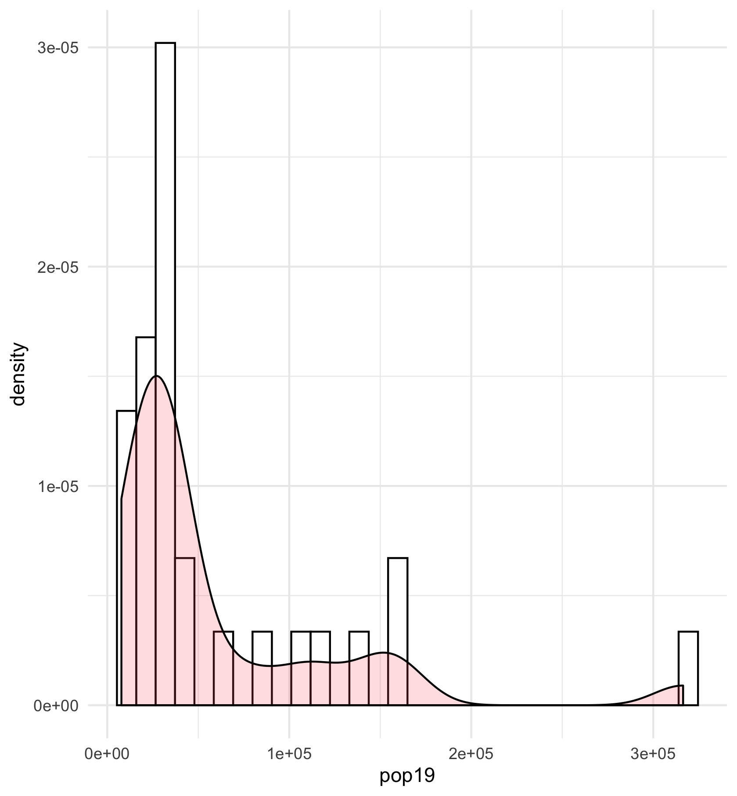
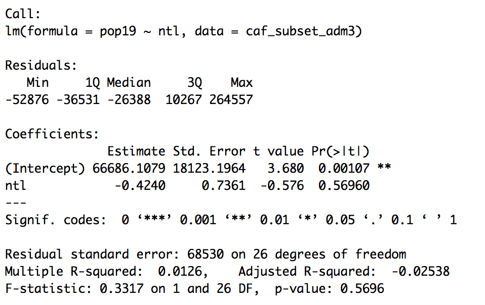
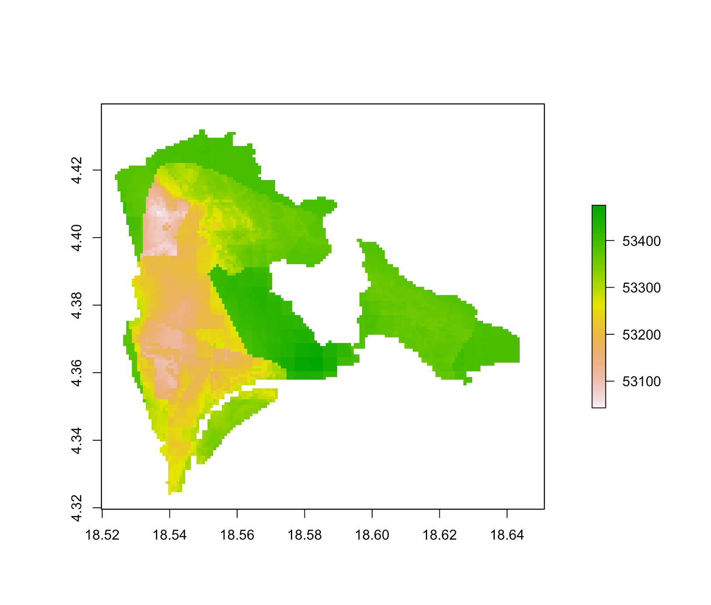
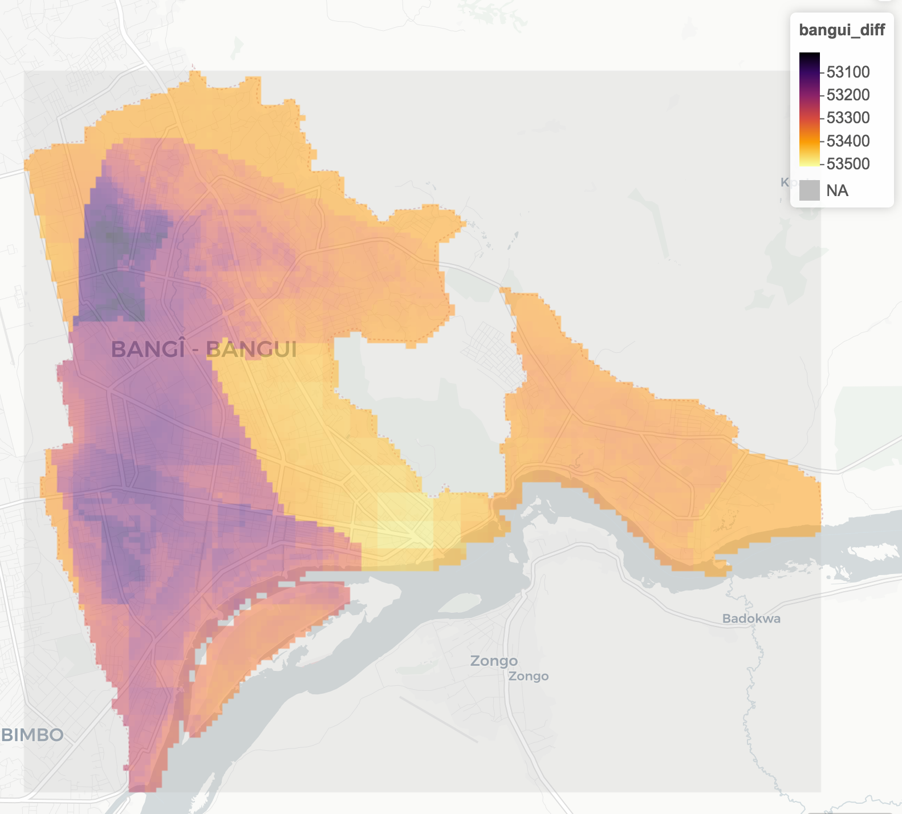
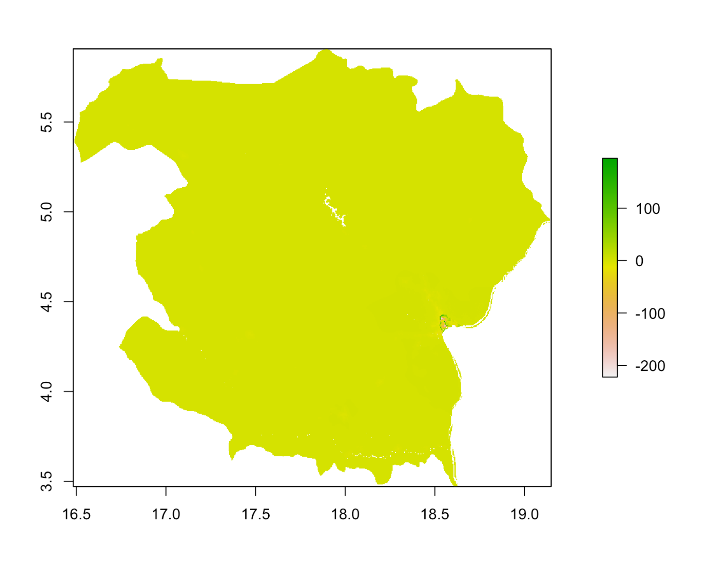

# Project 2

## Part 1

This is the histogram describing population in CAR's adm3s in and around Bangui. It shows you that more adm3s have lower populations, and there is one rather striking outlier. 

This is the graph describing population density in adm3s in and around Bangui. It shows you that the majority of adm3s have realtively low population density. This aligns with my previous knowledge of CAR's demographics—most of the country lives in small, rural villages. 

This histogram describing the spread of population density across adm3s shows the expected results considering CAR's rural nature. 

This is the regression showing the relationship between population and nighttime lights values. It seems to show that the two variables are very losely correlated—areas with similar population values have drastically different nighttime lights values. Also, once population values start to climb (likely the eight adm3s within Bangui), nighttime lights values start to converge, further complicating any correlation. Finally, there is one rogue outlier with a high ntl and population value. 

These are the parameters of the nighttime lights and population regression. The R sqaured is rather low at .4 and the residuals show a massive range, indicating lose correlation. 

This is the regression showing the relationship between population, nighttime lights, urban areas, and bare areas. Most of the points are clustered, but there is again a strange outlier.

These are the parameters from the above regression. Evidently, the range is very large and the R squared is quite small, showing a week correlation. Also, the significant codes inidcate that bare areas are the only data points that are remotely influencing this.

This is the regression with all 13 variables. Again, there is a massive outlier.

These are the parameters for the above regression. Again, the range is massive, the R sqaured is low, and the significant codes are dictating that only Lichens and Mosses are really affecting the regression. 

Of all the impactful shurbbery, I must say I never thought it'd be moss. 

## Part 2

This is the difference between the statistical model's predicted values and the actual population in each gridcell for three ADM1s. Evidently, most gridcells are wildley overestimated, especially the rural areas. 

This is the map of the difference between the predicted values of the population in each gridcell and the actual value for just Bangui. According to the legend, every gridcell is highly overestimated, but that is expected. The map seems to indicate that the areas with the highest overestimation (the brighest green) fall mainly around the edge of the city and in the mountain range to the left of the city (it's Arrondisement 1 if you want to reference earlier images). The areas with lower overestimation are the most populated districts in the city — Arrondisements 5 and 6. It is important to note that the actual differences between the error of each gridcell is rather low — the total scale spans 400 people. 

This is a map of the actual population of Bangui. This map very closely mirrors error conclusions from the prior. Clearly Arrondisement 1 is sparsely populated while Arrondisements 5 and 6 are more densely populated. 

This is the mapview of the error from the predictive model. 

## Part 3

This is the difference between the proportional allocation model (where predictors are sums of covariates) and the actual population of each gridcell. Evidently, the rural areas are rather accurately estimated. The interesting section is Bangui. The outskirts of the city are overestimated, while the more central areas are underestimated. 

This is the difference between the prorportional allocation with predictors being mean of covariates and the actual population of each gridcell. Here, most of the area was overestimated, with the only underestimation coming from the urban areas.

This is the difference between actual log of population and the predicted log using the mean of the covariates. This looks the same as the regular population predicted by the sum of the covariates. 

I think the best predictor is the sum of the covariates because the range of difference between predicted and actual values is the smallest. Because the log and sum graph look the same to the eye, I included information from R: 

