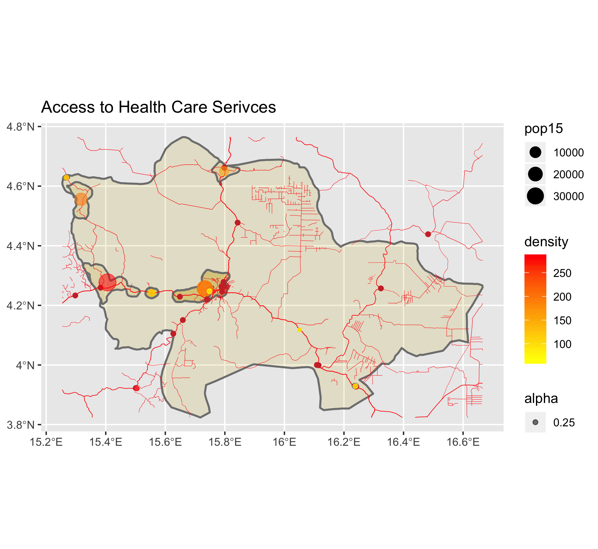

# Project 3

## Part 1

This is the graph of urban areas in the adm2 Berbérati (Mambéré-Kadéi prefecture). You can see that the largest urban area is on the border of Central African Republic and Cameroon. The largest city in Berbérati is Berbérati—the city located in the middle of the prefecture—so I went back and checked on this data to make sure I was right. I think I am, and that area is registering as more dense becuase it follows the road that comes in from Cameroon. There are few roads that come in to CAR from other countries, so lots of shipment related settlements such as mining (and rebel groups attempting to hijack government shipments) are probably located in this unincorporated area. You can track the influence of the road because there is another, less dense urban area noted right next to this unincorporated area. Farther down the road is the city of Berbérati. Other urban areas are along the edges of the adm2, and the one on the top righthand corner is also on the border with Cameroon. 

This is the graph of urban areas, road networks, and access to healthcare. The center points of urban areas are slightly transparent so that it is easier to differentiate an urban are from a health care installation (which are fully opaque red dots). Primarily, the city of Berbérati sticks out because it has rather clustered healthcare facilities and roads, so residents likely have adequate access to healthcare. The healthcare facilities seem to be spread out along the major roads that stem from the city, which makes sense. There are several hospitals that are located outside of urban areas, and that's a little strange. Those are probably more informal installations. Finally, the big red dot indicating a highly dense, highly populated urban area is suspicious because there is only one hospital. I investigated this by graphing the worldpop raster to see if the raw data reflected my calculated data. 

The raw data does match my processed data, so I am falling back to my original hypothesis—this area must be dominated by mining and rebel group activity. 
