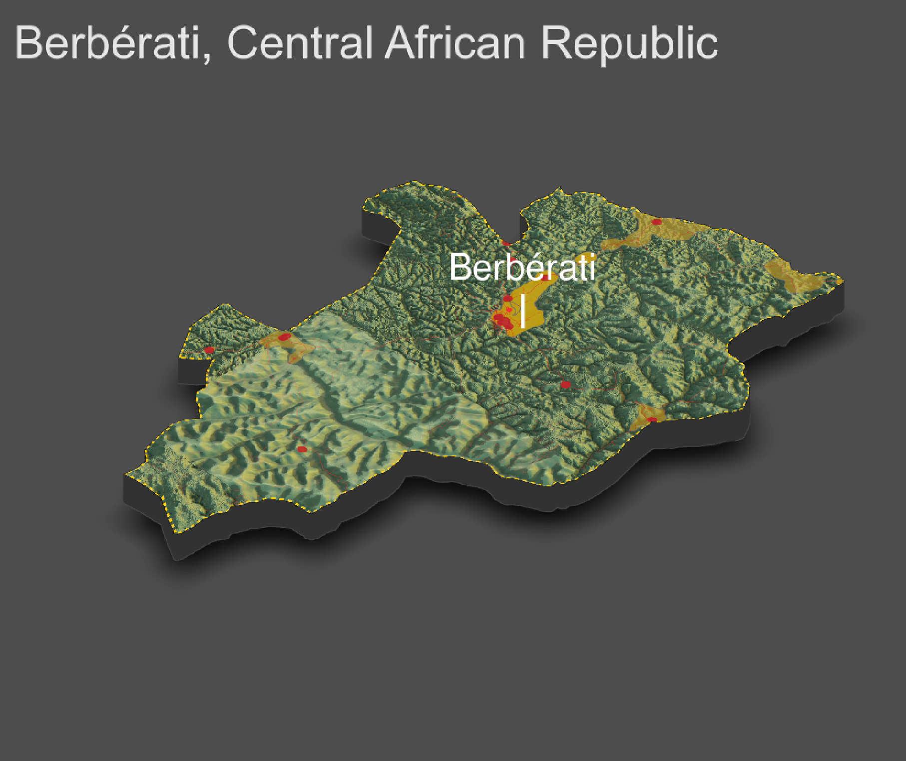

# Project 4

This is a 3D rendering of the Berbérati subprefecture. The red lines are the roads, the red dots are the healthcare facilities, and the yellow polygons are the urban areas. First, let's address the super blurry section. I hypothesize that this is one of two things: government coverup of illegal activity or bad data. The possible illegal activity would be mining by people connected to the Russian government (might I add that my road network map from project 3 indicates that there is definitely mining going on in these areas because the roads are perfect grids). However, bad data is just as plausible because the Central African Republic is a very data poor environment. 

As far as topographical analysis, topography doesn't appear to have influenced human settlement that much. The area doesn't appear flat, but it is not highly mountainous either. If you examine the roads, you'll see that they go straight over the raised terrain instead of arround. I think that if the terrain was larger moutains, then we would see more switch backs. Therefore, I am concluding that the topographical features of this sub prefecture are hills. This leads me to believe that the topography did not highly impact the location of human settlement, nor does it highly impact access to healthcare facilities. All of the hills can be traversed, so no one is physically blocked from a healthcare provider. The 3D plot did not change my analysis from project 3, but it is super cool. 
