# Catalog

Olivia Hettinger

## Workshop

1. [Line Plot](https://github.com/ohhettinger/wickedproblems/blob/master/plot2.png)

2. [The Path of a Salesman](https://github.com/ohhettinger/wickedproblems/blob/master/plot3.png)

3. [Challenge Problem](https://github.com/ohhettinger/wickedproblems/blob/master/challenge_question_1.png)

## Response to Readings

[Blumenstock Response](https://github.com/ohhettinger/wickedproblems/blob/master/blumenstock.md) (Jan. 27)

[Lloyd Response](https://github.com/ohhettinger/wickedproblems/blob/master/Lloyd.md) (Feb. 10)

[Wardrop Response](https://github.com/ohhettinger/wickedproblems/blob/master/Wardop.md) (Feb. 17)

[Stevens Response](https://github.com/ohhettinger/wickedproblems/blob/master/stevens.md) (Mar. 2)

## Project 1

### Part One

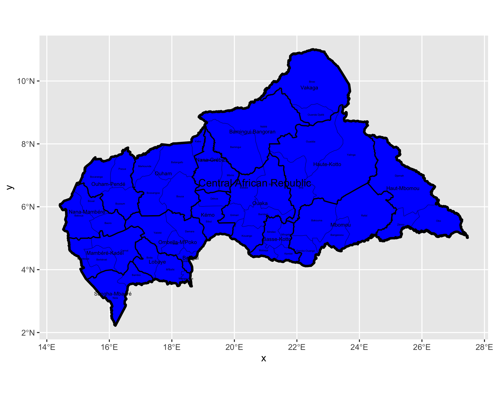

This part was relatively easy and straightforward. The one challenge I ran into was naming my ADM1 shapes, but I realized that I could employ tactics we used in the housing plot. After that, I worked mainly on moving certain labels so they were more visible. 
### Part Two

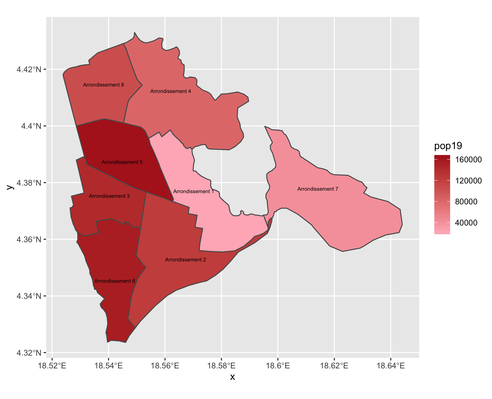

This was somewhat frustrating in the beginning because the boundary data I was using was bad. I was able to switch to more specific data, which put me in the right direction. After that, I ran into a road bump where I didn't understand that I was supposed to have regions within my subset, but once I got that, it was smooth sailing. 

### Part Three

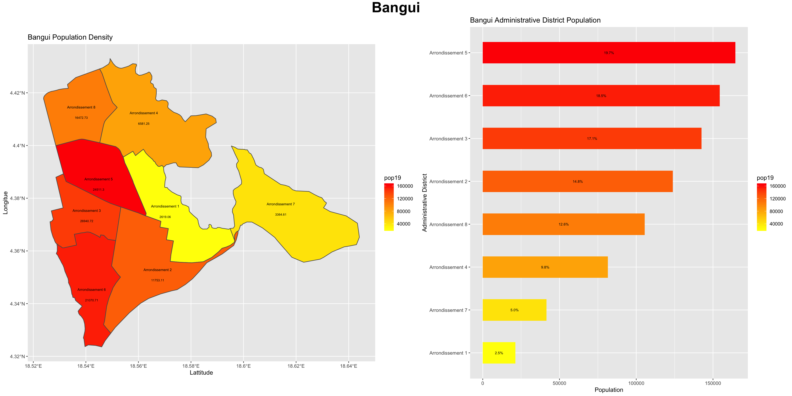

This is a plot of the population density in each administrative district in the capital city Bangui. Next to it is bar graph data showing the percent of population as a whole in each district. I made the plot by subsetting Central African Republic ADM1 data to just focus on Bangui. My biggest problem with this was typos. I had several typos in my code so it wasn't running and was frustrating me. But, once Professor Fraizer found the fact that I was spelling percent like "percente," then we were all good. 

I'm familiar with the demographics of the city, and this data works well with that knowledge. District five is the most populated, but that area contains a many of the schools that I was researching last semester. It surprised my that district two wasn't more populated, but I'm assuming that because it is the main commercial district of the city, there are fewer residential installations. Finally, it was no shock that district one had the smallest population because that is a mountain range. 

## Project 2

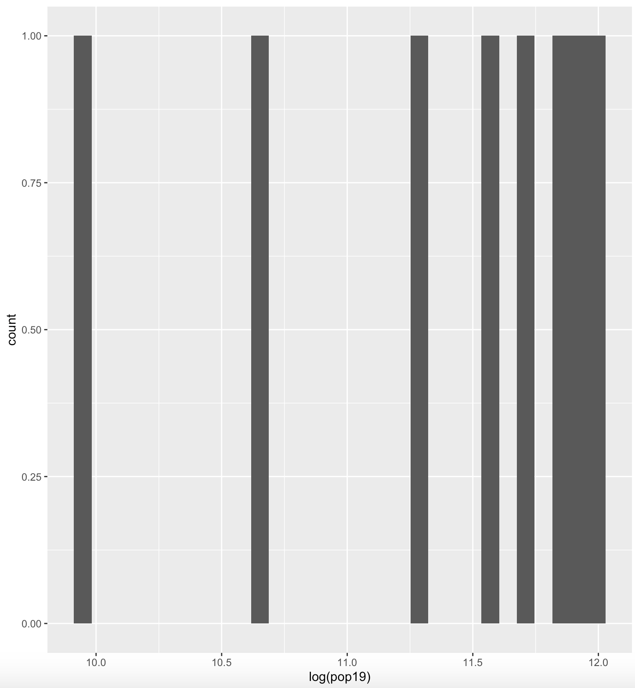

This is the histogram for the population distribution of the eight different ADM3s in Bangui. Because there are only eight observations, the histogram is not very informative at first glance. However, I went and looked at the population values for each ADM3, and noticed that several of them were really close together (within about 10,000 of one another). So, I decided to change the number of the bins so the close data points would be grouped together. The following is the manipulated graph:

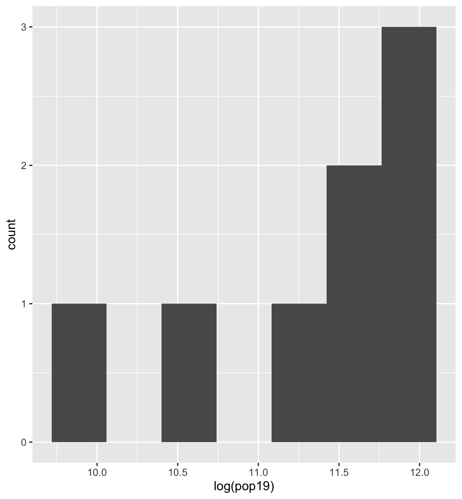

Lies, damn lies, and statistics. 

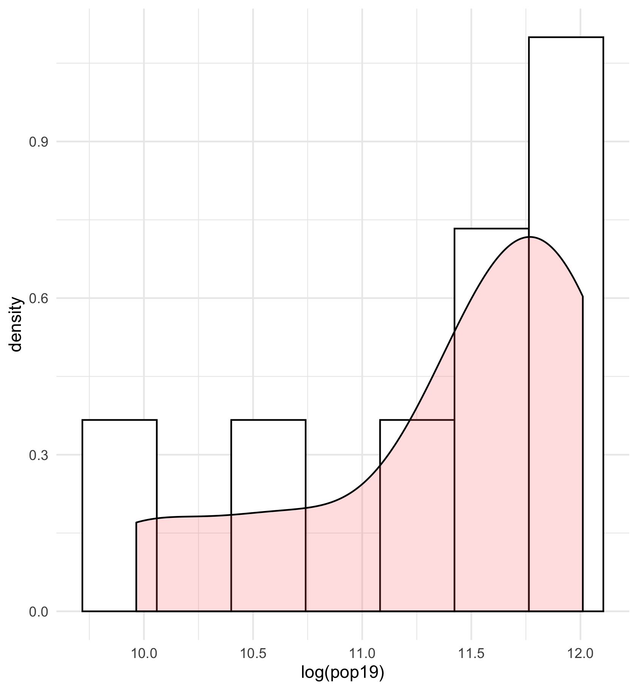

This is the histogram with the probability funcuction of the pop19 variable. This graph tells you that you have a higher probability of selected an ADM3 with relatively higher population. 

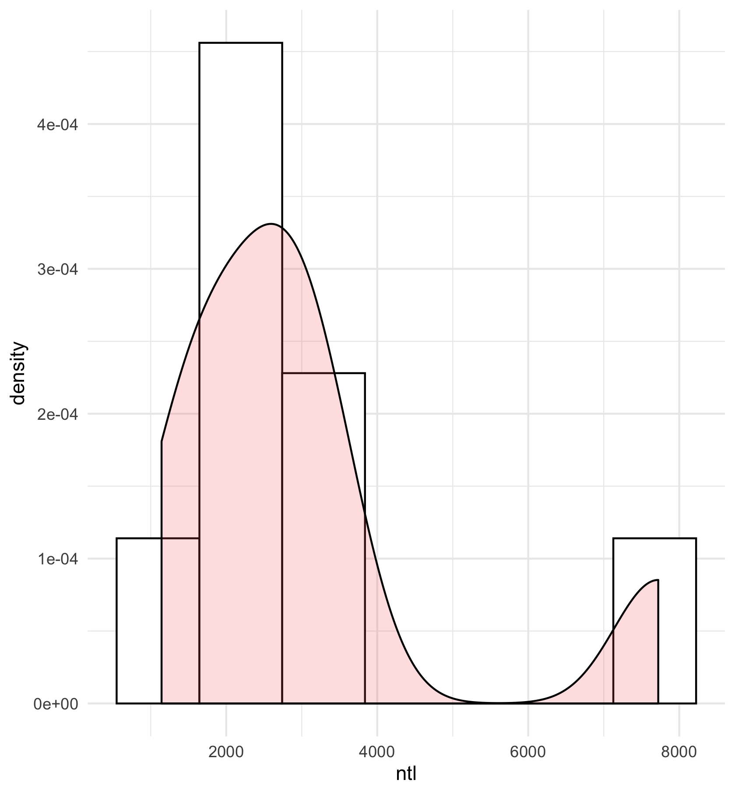

This is the probability density function against the nighttime lights variable. You are more likely to have an area with fewer nighttime lights, which is expected in such an underdeveloped country. The one ADM3 with higher nighttime lights values is likely the commercial area of the city, and the ADM3s with lower ntl values are the more residential areas. This makes sense considering the living conditions are very poor. 

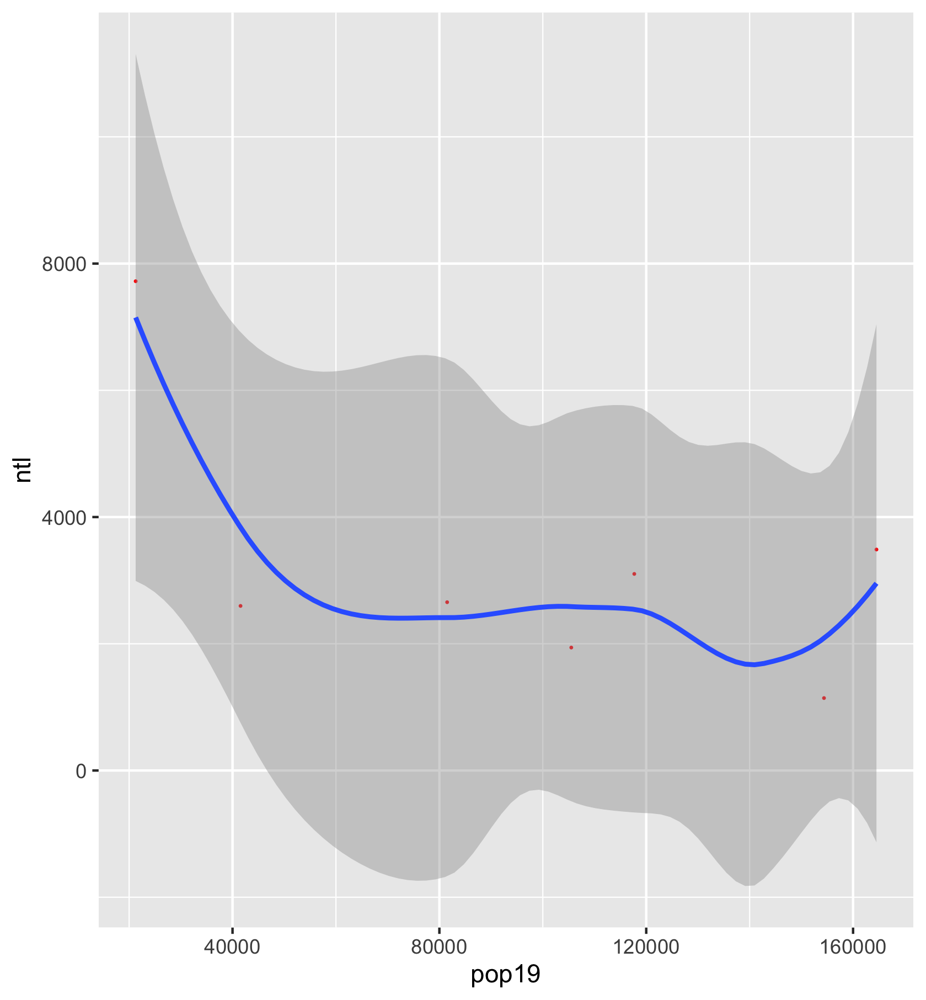

Just NTL

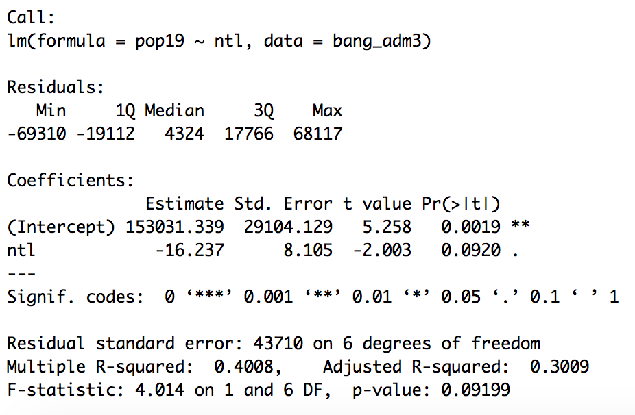

Residuals from NTL plot

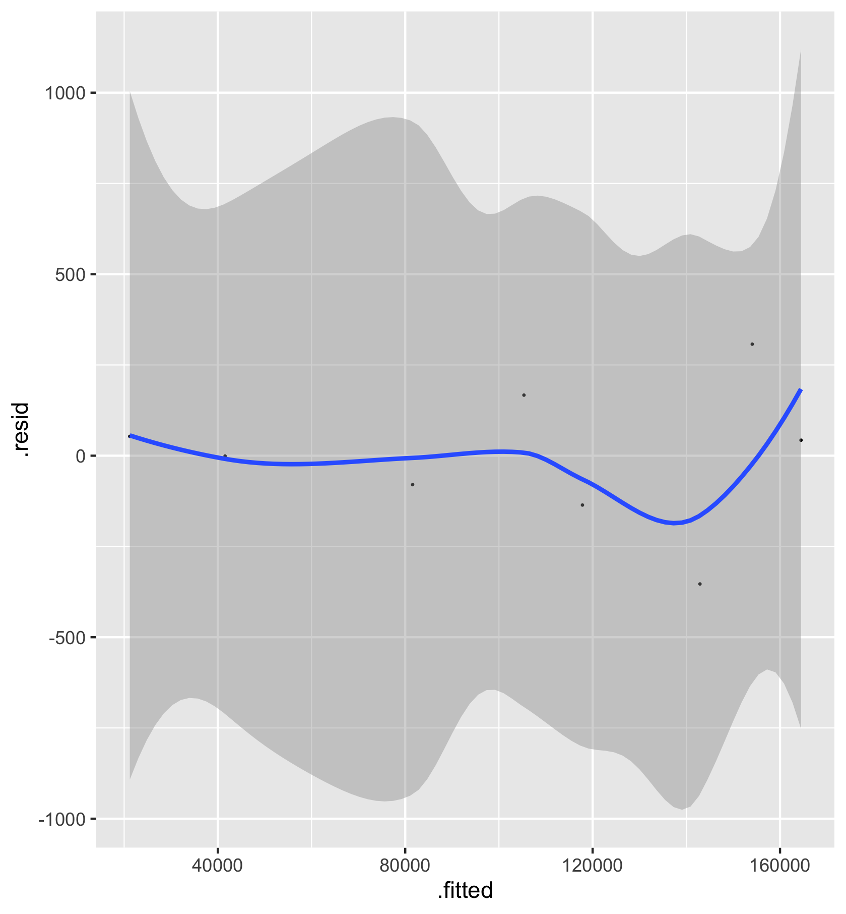

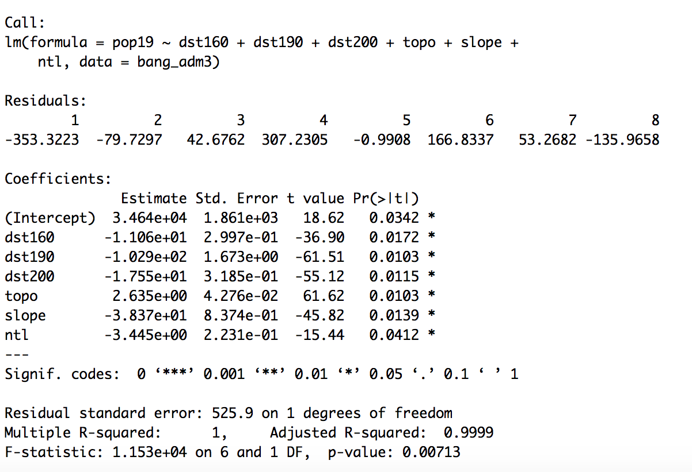

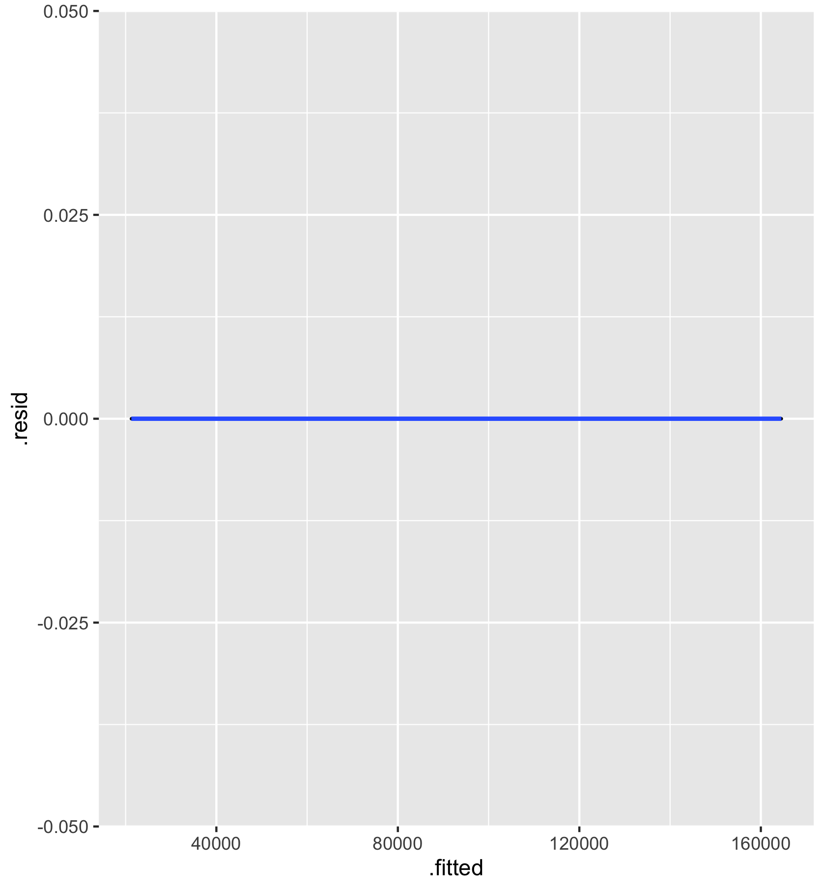

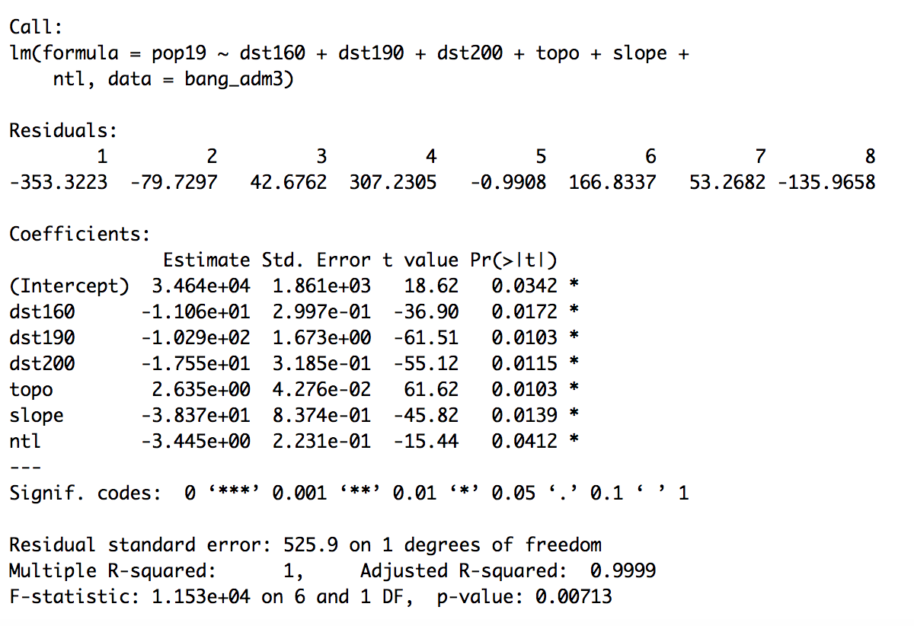

