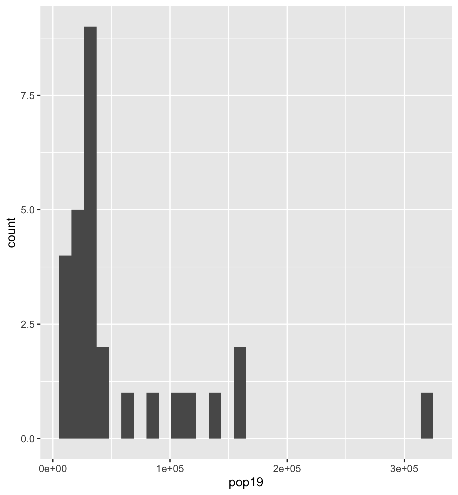
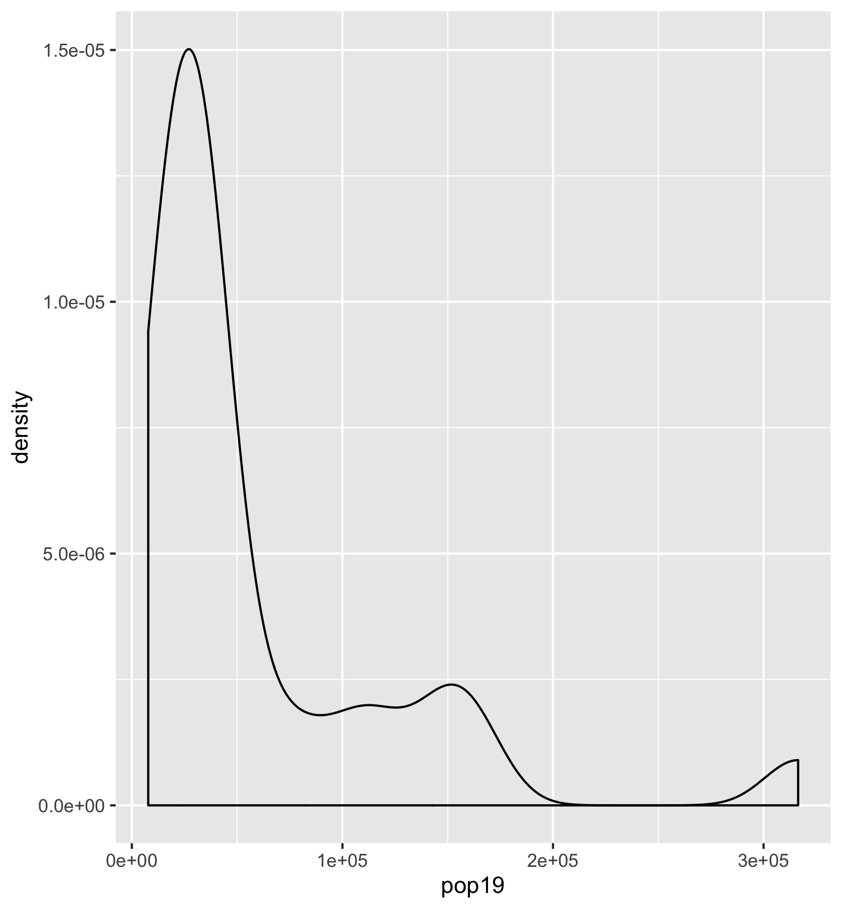
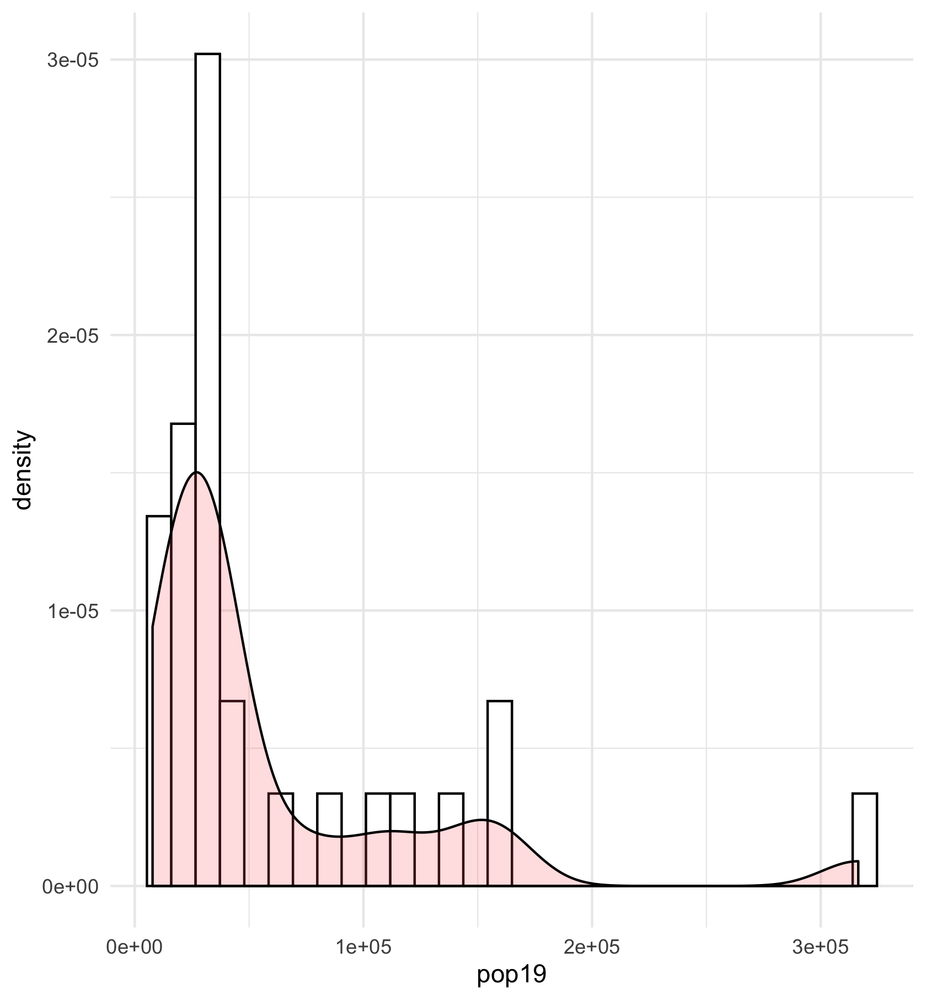
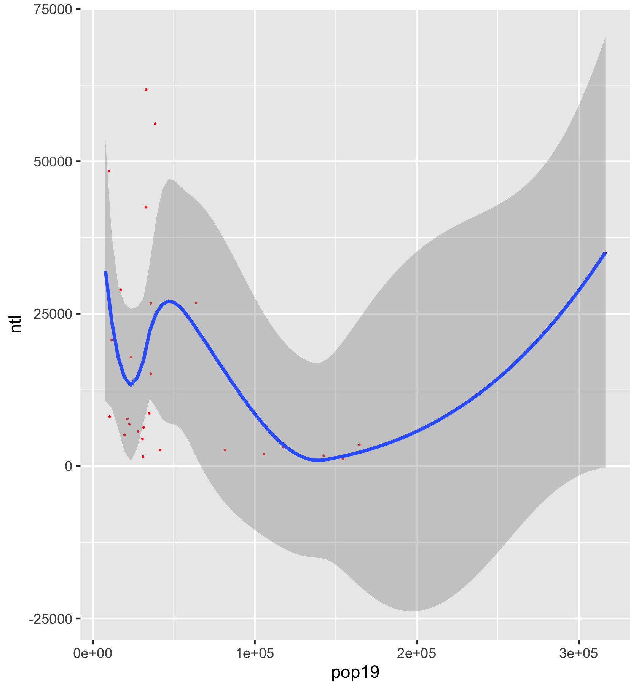
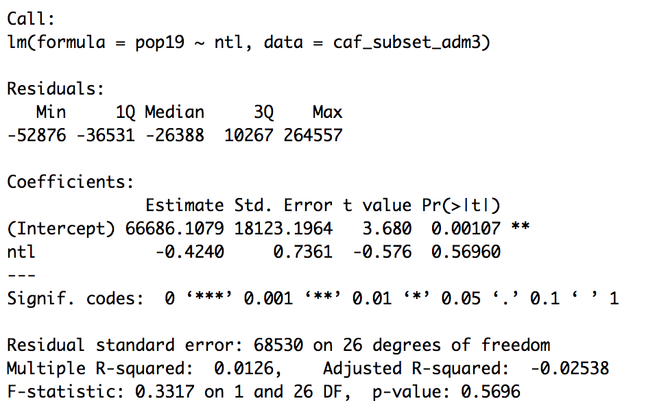

# Catalog

Olivia Hettinger

## Workshop

1. [Line Plot](https://github.com/ohhettinger/wickedproblems/blob/master/plot2.png)

2. [The Path of a Salesman](https://github.com/ohhettinger/wickedproblems/blob/master/plot3.png)

3. [Challenge Problem](https://github.com/ohhettinger/wickedproblems/blob/master/challenge_question_1.png)

## Response to Readings

[Blumenstock Response](https://github.com/ohhettinger/wickedproblems/blob/master/blumenstock.md) (Jan. 27)

[Lloyd Response](https://github.com/ohhettinger/wickedproblems/blob/master/Lloyd.md) (Feb. 10)

[Wardrop Response](https://github.com/ohhettinger/wickedproblems/blob/master/Wardop.md) (Feb. 17)

[Stevens Response](https://github.com/ohhettinger/wickedproblems/blob/master/stevens.md) (Mar. 2)

## Project 1

### Part One

This part was relatively easy and straightforward. The one challenge I ran into was naming my ADM1 shapes, but I realized that I could employ tactics we used in the housing plot. After that, I worked mainly on moving certain labels so they were more visible. 
### Part Two

This was somewhat frustrating in the beginning because the boundary data I was using was bad. I was able to switch to more specific data, which put me in the right direction. After that, I ran into a road bump where I didn't understand that I was supposed to have regions within my subset, but once I got that, it was smooth sailing. 

### Part Three

This is a plot of the population density in each administrative district in the capital city Bangui. Next to it is bar graph data showing the percent of population as a whole in each district. I made the plot by subsetting Central African Republic ADM1 data to just focus on Bangui. My biggest problem with this was typos. I had several typos in my code so it wasn't running and was frustrating me. But, once Professor Fraizer found the fact that I was spelling percent like "percente," then we were all good. 

I'm familiar with the demographics of the city, and this data works well with that knowledge. District five is the most populated, but that area contains a many of the schools that I was researching last semester. It surprised my that district two wasn't more populated, but I'm assuming that because it is the main commercial district of the city, there are fewer residential installations. Finally, it was no shock that district one had the smallest population because that is a mountain range. 

## Project 2

### Part 1

This is the histogram describing population in CAR's adm3s in and around Bangui. It shows you that more adm3s have lower populations, and there is one rather striking outlier. 

This is the graph describing population density in adm3s in and around Bangui. It shows you that the majority of adm3s have realtively low population density. This aligns with my previous knowledge of CAR's demographics—most of the country lives in small, rural villages. 

This histogram describing the spread of population density across adm3s shows the expected results considering CAR's rural nature. 

This is the regression showing the relationship between population and nighttime lights values. It seems to show that the two variables are very losely correlated—areas with similar population values have drastically different nighttime lights values. Also, once population values start to climb (likely the eight adm3s within Bangui), nighttime lights values start to converge, further complicating any correlation. Finally, there is one rogue outlier with a high ntl and population value. 

These are the parameters of the nighttime lights and population regression. The R sqaured is rather low at .4 and the residuals show a massive range, indicating lose correlation. 

